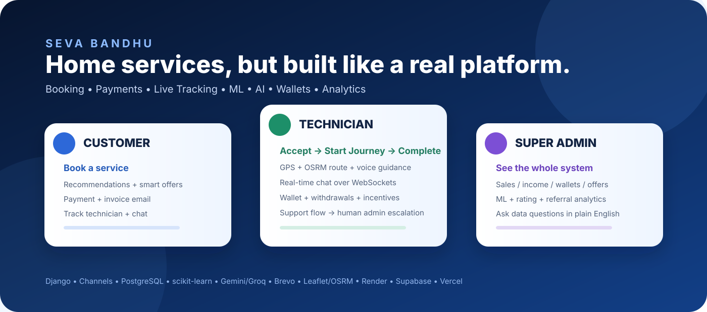
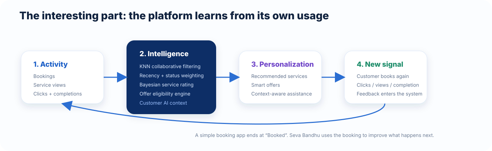
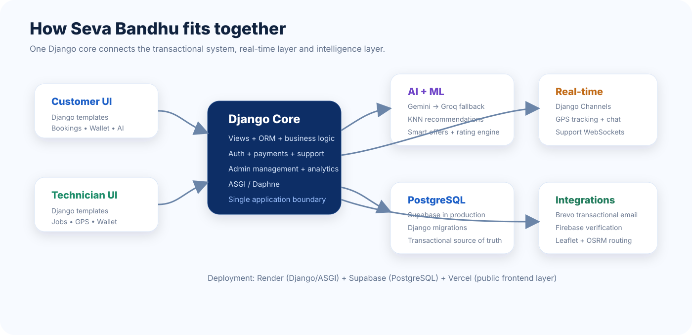

# Seva Bandhu

  

  <b>A home-service platform that connects customers, technicians and administrators — with real-time systems, ML personalization, AI assistance and operational analytics built into the same product.</b>

  <a href="https://seva-bandhu-src9060.onrender.com">Live Demo</a>
  ·
  <a href="https://github.com/SRC9060/Seva-Bandhu">Source Code</a>

---

## Why Seva Bandhu is interesting

This started as a service-booking idea. It grew into a much broader engineering system.

A customer can book a service, receive an OTP, get personalized recommendations, see smart offers, pay, receive an invoice, track the technician live, chat during the journey, and leave feedback.

At the other end, the technician gets job dispatch, navigation, live GPS, chat, earnings, withdrawals and incentive missions.

And the admin does not just get a CRUD dashboard — the platform exposes financial analytics, ML analytics, offer performance, wallet activity, support, ratings, and a read-only natural-language data assistant for questions like:

> Which technician completed the most jobs this month?  
> How much did Rahul earn?  
> Which service generated the most sales?

The goal was simple: make the booking flow feel like a real product, not just a database with forms.

---

## The 3 things I am most proud of

### 01 — The platform learns from usage

Seva Bandhu has a collaborative-filtering recommendation engine.

It builds a customer × service interaction matrix, applies recency and booking-status weighting, finds similar customers with cosine-distance KNN, and blends:

- 70% from the customer's own history
- 30% from similar customers

Recommendations are also logged so clicks and bookings can be measured later.

  

---

### 02 — Real-time tracking is part of the product

The technician journey is not a fake map animation.

Django Channels handles the real-time connection for tracking and chat. The technician navigation page uses:

- browser geolocation
- Leaflet
- Leaflet Routing Machine
- OSRM road routing
- live distance / ETA
- route recalculation
- arrival-state handling
- browser speech synthesis for voice guidance

The backend also validates the authenticated participant and persists tracking snapshots.

---

### 03 — The admin side has its own intelligence layer

Two very different assistants exist in the project.

Customer AI Assistant

Gemini is the primary provider and Groq is the fallback. The assistant receives context belonging to the currently logged-in customer and is instructed not to invent booking, technician, price or status data.

Admin Data Assistant

This one deliberately does not use an LLM.

It is a deterministic, read-only, database-backed assistant for the admin panel. The idea is useful for operations: ask the database questions in natural language instead of digging through tables manually.

---

## What makes the system unusual

### A rating engine without fake stars

Service ratings are calculated from completed bookings plus validated complaints, not hardcoded values.

The current implementation applies Bayesian smoothing so a service with very little history does not get an unstable rating from one early complaint.

### Smart offers react to intent

The offer system tracks recent service interest and can trigger a smart offer after repeated service views within the configured window.

It also checks eligibility, minimum order value, usage limits, per-customer limits, service applicability and cooldown rules.

Most importantly, ML recommendation scores can influence which eligible offer is surfaced first.

### Technician support is a guided decision tree

The technician support assistant is intentionally deterministic.

It walks through predefined categories such as:

- payment / earnings
- service / booking
- wallet / withdrawal
- incentives
- technical issues
- account / profile

If guided troubleshooting cannot solve the issue, it can escalate to human admin support while keeping the support session context.

### Wallet operations are transactional

Technician earnings, incentives, withdrawals and reversals are handled through database transactions and row locking so concurrent wallet updates do not casually corrupt balances.

---

## End-to-end product flow

~~~text
Customer
   |
   |  Signup / OTP / Login
   v
Service Discovery
   |
   +--> ML Recommendations
   |
   +--> Smart Offers
   |
   v
Service Request
   |
   +--> Payment
   |      +--> Invoice PDF
   |      +--> Brevo email
   |
   v
Technician Assignment
   |
   +--> Live GPS + Route + Voice
   +--> Real-time Chat
   |
   v
Service Completion
   |
   +--> Technician Earnings
   +--> Incentive Evaluation
   +--> Customer Rating / Complaint
   |
   v
Admin Analytics + Admin Data Assistant
~~~

---

## Architecture

  

The application is centered around Django rather than splitting the business rules between multiple disconnected services.

~~~text
Customer / Technician
        |
        v
 Django Templates + Views
        |
        +--------------------+
        |                    |
        v                    v
  Django ORM           Django Channels
        |                    |
        v                    +--> Tracking
  Supabase PostgreSQL        +--> Chat
        |                    +--> Support
        |
        +--> ML / Ratings / Offers / Wallets / Analytics
        |
        +--> Gemini / Groq
        |
        +--> Brevo / Firebase / OSRM
~~~

---

## Core features

### Customer

- Email OTP verification
- Firebase phone verification
- Google sign-in flow
- Service discovery and booking
- Dynamic service ratings
- Online/offline payment flows
- Customer wallet
- Invoice PDF + email
- Live technician tracking
- Real-time chat
- Technician ratings
- Complaints / support tickets
- Offers and referrals
- Personalized ML recommendations
- Smart offers
- Customer AI assistant

### Technician

- Registration + profile completion
- Job dispatch and acceptance
- Status management
- Start Journey flow
- Live GPS tracking
- OSRM navigation
- Voice guidance
- Real-time chat
- Notifications
- Wallet + earnings
- Withdrawals
- Incentive missions
- Guided support + admin escalation

### Super Admin

- Customers
- Technicians
- Services
- Service requests
- Offers
- Customer offers
- Referrals
- Support tickets
- Technician support
- Incentives
- Withdrawals
- Ratings
- Platform analytics
- Comprehensive financial analytics
- Read-only Admin Data Assistant

---

## Machine learning

Model: collaborative filtering with scikit-learn KNN

Signal design:

- completed interactions → strong positive signal
- assigned / in-progress interactions → positive signal
- pending interactions → weaker positive signal
- cancelled interactions → negative signal
- recency decay → recent activity matters more
- similar customers → collaborative signal
- cold start → popularity fallback

Measurement: recommendation impressions, clicks and bookings are stored in RecommendationLog, enabling CTR and conversion analytics.

Relevant modules:

~~~text
backend/core/ml/recommender.py
backend/core/ml/train_recommender.py
backend/core/ml/model/
~~~

---

## Intelligent offers

The offer engine combines business rules with recommendation signals.

It supports:

- new-customer targeting
- frequent-customer targeting
- service-specific offers
- flat discounts
- percentage discounts
- maximum discount caps
- minimum order values
- usage limits
- per-customer limits
- expiry windows
- customer offer assignments
- recent intent tracking
- cooldown protection
- ML-aware offer prioritization

Relevant module:

~~~text
backend/core/services/offer_engine.py
~~~

---

## Real-time layer

Django Channels / WebSockets power:

~~~text
/ws/requests/
                -> technician request notifications

/ws/tracking/<request_id>/
                -> live technician tracking

/ws/chat/<request_id>/
                -> customer <-> technician chat

/ws/support/technician/<session_id>/
                -> technician <-> admin support
~~~

The tracking consumer validates the authenticated participant, validates coordinates, persists tracking data and distributes authorized location updates.

---

## AI layer

### Customer AI

~~~text
Gemini
   |
   | failure / unavailable
   v
Groq fallback
~~~

The customer assistant receives context derived from the logged-in customer's account, recent requests and available services.

### Admin Data Assistant

~~~text
Admin question
     |
     v
Deterministic parser
     |
     v
Controlled Django ORM query
     |
     v
Database-backed answer
~~~

No LLM is required for the admin assistant.

Relevant modules:

~~~text
backend/core/ai/
backend/core/services/admin_assistant.py
~~~

---

## Financial + operations analytics

The admin analytics layer keeps different money concepts separate:

- customer sales / payments
- technician earnings
- platform income
- discounts
- referral rewards
- incentive payouts
- withdrawal requests
- approved / rejected / pending withdrawals
- reversals

It also surfaces operational metrics around customers, technicians, bookings, services, ratings, complaints, recommendations and offers.

---

## Stack

| Layer | Technology |
|---|---|
| Backend | Python, Django 5.2 |
| Real-time | Django Channels, Daphne / ASGI |
| Database | PostgreSQL (Supabase) |
| Local DB | SQLite fallback |
| ML | scikit-learn, NumPy, pandas, joblib |
| AI | Google Gemini, Groq |
| Maps | Leaflet, Leaflet Routing Machine, OSRM |
| Email | Brevo transactional API |
| Verification | Firebase |
| PDF | ReportLab, xhtml2pdf |
| Frontend layer | Django templates + Vite/React foundation |
| Deployment | Render + Supabase + Vercel |

---

## Deployment

### Render

The Django application runs as an ASGI service with Daphne.

### Supabase

PostgreSQL is the production database and Django migrations remain the schema source of truth.

### Vercel

SevaBandhu-Frontend contains the public frontend/deployment layer.

Current Vercel settings:

~~~text
Root Directory: SevaBandhu-Frontend
Build Command: npm run build
Output Directory: dist
Install Command: npm install
~~~

The existing Django pages continue to provide the application's full working UI while the standalone Vercel frontend evolves independently.

---

## Run locally

### Backend

~~~bash
cd backend
python -m venv .venv
pip install -r requirements.txt
python manage.py migrate
python manage.py runserver
~~~

On Windows PowerShell:

~~~powershell
.\\.venv\\Scripts\\Activate.ps1
~~~

### Environment

Copy:

~~~text
.env.example -> .env
~~~

Typical production integrations use:

~~~text
DATABASE_URL=
BREVO_API_KEY=
BREVO_SENDER_EMAIL=
GEMINI_API_KEY=
GROQ_API_KEY=
FIREBASE_API_KEY=
...
~~~

Never commit real secrets.

### Frontend build

~~~bash
cd SevaBandhu-Frontend
npm install
npm run build
~~~

---

## Repository map

~~~text
backend/core/
├── ai/                  # Customer AI
├── ml/                  # Recommendation engine
├── services/            # Ratings, offers, wallet, incentives, support, admin assistant
├── models.py            # Core data model
├── views.py             # Customer + technician application flows
├── admin_views.py       # Super-admin operations + analytics
├── consumers.py         # WebSocket consumers
└── routing.py           # WebSocket routing

SevaBandhu-Frontend/
├── templates/
│   ├── customer/
│   ├── technician/
│   └── admin_custom/
├── assets/
└── src/                 # Vite/React frontend foundation
~~~

---

## A few implementation details worth exploring

Start here if you want to understand the project quickly:

~~~text
backend/core/models.py
backend/core/views.py
backend/core/consumers.py
backend/core/analytics_helper.py

backend/core/ml/recommender.py
backend/core/ml/train_recommender.py

backend/core/services/offer_engine.py
backend/core/services/rating_engine.py
backend/core/services/technician_wallet.py
backend/core/services/incentive_engine.py
backend/core/services/support_flow.py
backend/core/services/admin_assistant.py

backend/core/ai/chatbot.py
~~~

---

  <b>Seva Bandhu is not just “book a technician.”</b> 
  It is a service platform with personalization, real-time logistics, financial workflows and operational intelligence built around the booking lifecycle.

